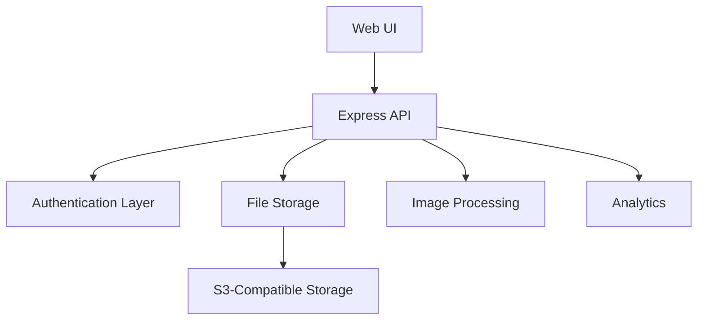
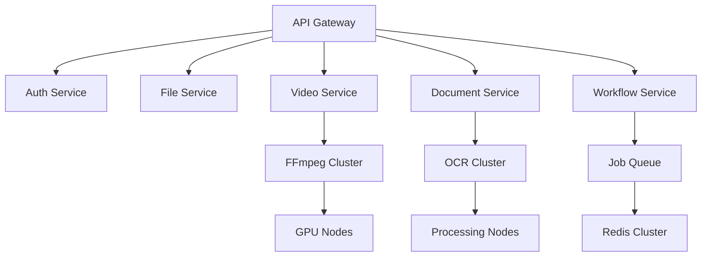
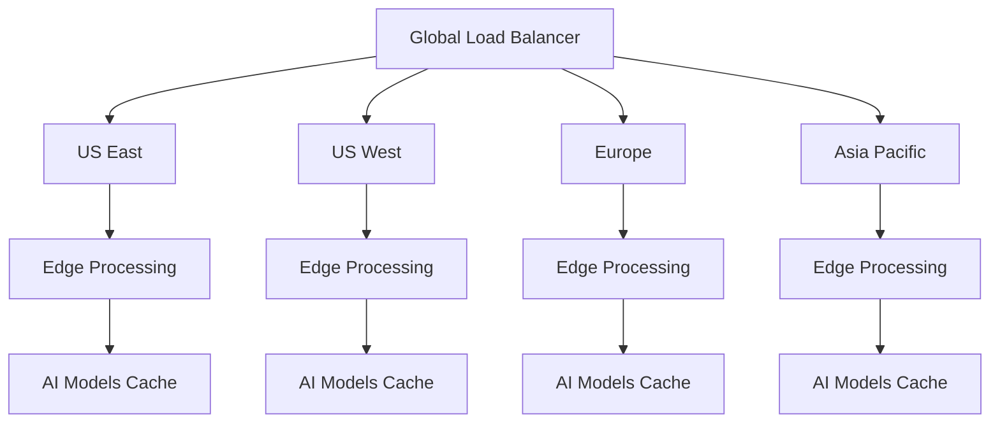

# DMAPI: The Universal Media Processing Platform - Complete Vision Document

## Executive Summary

Dailey Media API (DMAPI) is positioned to become the dominant universal media processing platform, transforming how businesses handle digital content across the internet. Our vision extends far beyond simple file storage to create an intelligent, AI-powered media processing ecosystem that handles any file format, performs any transformation, and delivers optimal results automatically.

**Core Mission**: Democratize professional-grade media processing by making advanced video editing, document conversion, and AI-powered content analysis accessible through simple API calls.

**Market Opportunity**: The global video streaming market ($70B by 2027) and document processing market ($6.5B by 2026) represent massive opportunities for a unified platform that handles both seamlessly.

## The Complete Vision: "Any File, Any Format, Any Transformation"

### Phase 1: Universal Storage Foundation (✅ Complete)
DMAPI has established itself as a production-ready media storage platform with enterprise-grade security, serving multiple applications in the DAILEY ecosystem. Current capabilities include secure file storage, image processing, analytics, and a modern web interface.

### Phase 2: Media Processing Engine (🚧 2025)
Transform DMAPI into a comprehensive media processing powerhouse with:
- **Video & Audio Processing**: Professional-grade transcoding, streaming, and enhancement
- **Document Intelligence**: Universal conversion, OCR, and intelligent document understanding
- **Workflow Automation**: Event-driven processing pipelines

### Phase 3: AI-Powered Intelligence (🎯 2025-2026)
Integrate advanced AI capabilities for:
- **Content Analysis**: Auto-tagging, object detection, scene recognition
- **Smart Optimization**: AI-driven compression and quality enhancement  
- **Predictive Processing**: Machine learning-optimized workflows

### Phase 4: Platform Ecosystem (🔮 2026-2027)
Evolve into a comprehensive platform with:
- **Marketplace**: Third-party plugins and extensions
- **White-label Solutions**: Complete media processing platforms for enterprises
- **Edge Computing**: Global distributed processing network

## Hardware Architecture & Infrastructure

### Current Infrastructure (Production v1.0)
```yaml
Production_Environment:
  Provider: "DAILEY Cloud Infrastructure"
  Specifications:
    CPU: "Multi-core x86_64"
    Memory: "16-32GB RAM"
    Storage: "S3-compatible object storage"
    Network: "High-bandwidth connectivity"
  
  Capabilities:
    - File storage and retrieval
    - Basic image processing (thumbnails, metadata)
    - User authentication and security
    - Analytics and monitoring
    - Web interface and API endpoints
```

### Phase 2: Media Processing Infrastructure
```yaml
Video_Processing_Cluster:
  Primary_Node:
    CPU: "AMD EPYC 7443P (24 cores, 2.85GHz)"
    GPU: "NVIDIA RTX 4090 (24GB VRAM) x2"
    Memory: "128GB DDR4 ECC"
    Storage: "4TB NVMe SSD (processing cache)"
    Network: "25Gbps"
    
  Performance_Targets:
    Concurrent_1080p_Jobs: 12-15
    Processing_Speed: "3-5x realtime"
    Monthly_Capacity: "10,000+ videos"
    
  Cloud_Scaling:
    Burst_Capacity: "AWS/GCP GPU instances"
    Auto_Scaling: "Queue-depth triggered"
    Global_Regions: "3+ geographic locations"
    Cost_Optimization: "Spot instances, preemptible VMs"
```

### Phase 3: AI Processing Infrastructure
```yaml
AI_Cluster:
  Machine_Learning_Nodes:
    GPU: "NVIDIA A100 (80GB) or H100"
    CPU: "Intel Xeon Platinum 8380"
    Memory: "512GB RAM"
    Storage: "10TB NVMe (model cache)"
    
  Specialized_Workloads:
    Computer_Vision: "Image/video analysis"
    NLP_Processing: "Document understanding, OCR"
    Audio_Processing: "Speech recognition, enhancement"
    Custom_Models: "Industry-specific training"
```

### Phase 4: Global Edge Network
```yaml
Edge_Computing_Network:
  Geographic_Distribution:
    - North_America: "5+ edge locations"
    - Europe: "4+ edge locations" 
    - Asia_Pacific: "3+ edge locations"
    - Other_Regions: "Expanding coverage"
    
  Edge_Capabilities:
    - Real-time processing
    - Content delivery optimization
    - Local compliance (GDPR, data residency)
    - Reduced latency (<50ms globally)
```

## Developer Stories: 20 Real-World Use Cases

### Content Creation & Media
**1. Video Content Creator Platform**
```javascript
// YouTuber uploads raw 4K footage, gets optimized outputs
const creator = {
  problem: "Spending 8 hours/day on video rendering instead of creating content",
  solution: await dmapi.processVideo(rawFootage, {
    outputs: [
      { platform: 'youtube', quality: '4K' },
      { platform: 'tiktok', format: 'vertical', duration: 60 },
      { platform: 'instagram', format: 'square', duration: 90 },
      { platform: 'twitter', quality: '1080p', compression: 'high' }
    ],
    enhancements: ['auto-color-correct', 'noise-reduction', 'auto-subtitles']
  }),
  outcome: "Reduces post-production time from 8 hours to 30 minutes",
  revenue_impact: "$500/month in API fees per creator, 10,000+ creators = $5M/month"
}
```

**2. Podcast Production Company**
```javascript
// Podcast network processes 100+ episodes weekly
const podcastNetwork = {
  workflow: await dmapi.createWorkflow({
    name: 'Podcast Production Pipeline',
    steps: [
      { action: 'audio.normalize', params: { target: '-16 LUFS' } },
      { action: 'audio.enhance', params: ['noise-gate', 'compressor'] },
      { action: 'speech.transcribe', params: { speakers: true, chapters: true } },
      { action: 'audio.export', formats: ['mp3', 'aac', 'opus'] },
      { action: 'metadata.inject', params: { chapters: true, artwork: true } }
    ]
  }),
  business_value: "Processes 100 episodes/week automatically vs 40 hours manual work",
  revenue_impact: "$2,000/month per network, 500+ networks = $1M/month"
}
```

**3. E-commerce Product Photography**
```javascript
// Online retailer with 50,000+ products
const ecommerce = {
  automation: await dmapi.processImages(productPhotos, {
    pipeline: [
      { action: 'background.remove' },
      { action: 'image.enhance', params: { brightness: 'auto', contrast: 'auto' } },
      { action: 'resize.variants', sizes: ['thumbnail', 'gallery', 'zoom', 'mobile'] },
      { action: 'format.optimize', formats: ['webp', 'avif', 'jpg'] },
      { action: 'seo.generate', params: ['alt-text', 'product-tags'] }
    ]
  }),
  cost_savings: "Replaces $50,000/month photography studio costs",
  revenue_impact: "$1,500/month per retailer, 2,000+ retailers = $3M/month"
}
```

### Enterprise & Document Processing
**4. Legal Document Management**
```javascript
// Law firm processing thousands of legal documents
const lawFirm = {
  compliance: await dmapi.processDocuments(legalDocs, {
    ocr: { languages: ['en', 'es'], accuracy: 'high' },
    extraction: ['dates', 'parties', 'clauses', 'signatures'],
    redaction: { pii: true, attorney_client: true },
    conversion: { format: 'pdf-a', searchable: true },
    security: { encryption: 'aes-256', access_logs: true }
  }),
  productivity_gain: "10x faster document review and discovery",
  revenue_impact: "$5,000/month per firm, 1,000+ firms = $5M/month"
}
```

**5. Insurance Claims Processing**
```javascript
// Insurance company automating claims with photos/documents
const insuranceCo = {
  claimsAI: await dmapi.analyzeContent(claimFiles, {
    damage_assessment: {
      photos: ['vehicle-damage', 'property-damage', 'medical-reports'],
      confidence_threshold: 0.85,
      fraud_detection: true
    },
    document_processing: {
      forms: ['auto-fill', 'validation'],
      medical_records: ['ocr', 'classification'],
      estimates: ['amount-extraction', 'verification']
    }
  }),
  efficiency_gain: "Reduces claim processing from 14 days to 2 hours",
  revenue_impact: "$10,000/month per insurer, 500+ insurers = $5M/month"
}
```

**6. Healthcare Document Digitization**
```javascript
// Hospital system digitizing paper records
const healthcareSystem = {
  hipaaCompliant: await dmapi.processRecords(medicalRecords, {
    ocr: { medical_terminology: true, handwriting: true },
    classification: ['patient-info', 'diagnoses', 'treatments', 'prescriptions'],
    privacy: { hipaa_compliant: true, audit_trail: true },
    integration: { ehr_systems: ['epic', 'cerner'], hl7_export: true }
  }),
  compliance_value: "Meets HIPAA requirements with complete audit trails",
  revenue_impact: "$8,000/month per hospital, 2,000+ hospitals = $16M/month"
}
```

### Education & Training
**7. Online Learning Platform**
```javascript
// EdTech platform with video courses and interactive content
const edTechPlatform = {
  courseProduction: await dmapi.processEducationalContent(courses, {
    video: {
      interactive_elements: ['quizzes', 'timestamps', 'chapters'],
      accessibility: ['auto-subtitles', 'audio-descriptions', 'transcripts'],
      adaptive_streaming: { quality_levels: 5, mobile_optimized: true }
    },
    documents: {
      course_materials: ['pdf-generation', 'interactive-pdfs'],
      assignments: ['auto-grading', 'plagiarism-detection']
    }
  }),
  student_engagement: "40% increase in course completion rates",
  revenue_impact: "$3,000/month per platform, 1,500+ platforms = $4.5M/month"
}
```

**8. Corporate Training Company**
```javascript
// Enterprise training with multi-language support
const corporateTraining = {
  globalization: await dmapi.localizeContent(trainingMaterials, {
    languages: ['en', 'es', 'fr', 'de', 'zh', 'ja'],
    video: {
      subtitle_translation: { ai_powered: true, human_review: true },
      voice_dubbing: { preserve_timing: true, lip_sync: false }
    },
    documents: {
      translation: 'professional_grade',
      cultural_adaptation: true,
      compliance: ['gdpr', 'local_regulations']
    }
  }),
  market_expansion: "Enables entry into 50+ international markets",
  revenue_impact: "$7,500/month per company, 800+ companies = $6M/month"
}
```

### Real Estate & Architecture
**9. Real Estate Photography Service**
```javascript
// Photography service for real estate agents
const realEstatePhotography = {
  propertyEnhancement: await dmapi.enhanceRealEstate(propertyImages, {
    hdr_processing: { auto_exposure: true, highlight_recovery: true },
    virtual_staging: { furniture_placement: true, decor_options: 5 },
    sky_replacement: { weather_improvement: true, time_of_day: 'golden_hour' },
    perspective_correction: { auto_keystone: true, lens_distortion: true },
    marketing_materials: {
      flyers: { templates: 20, auto_layout: true },
      virtual_tours: { 360_degree: true, interactive_hotspots: true }
    }
  }),
  sales_impact: "Properties sell 23% faster with enhanced imagery",
  revenue_impact: "$1,200/month per photographer, 5,000+ photographers = $6M/month"
}
```

**10. Architecture Visualization Firm**
```javascript
// Architectural firm creating client presentations
const archFirm = {
  visualizationPipeline: await dmapi.processArchitecturalContent(designs, {
    cad_processing: {
      formats: ['dwg', 'skp', 'rvt', '3ds'],
      conversion: { target: 'web_optimized_3d' },
      rendering: { photorealistic: true, lighting: 'dynamic' }
    },
    client_deliverables: {
      presentations: { interactive_3d: true, vr_compatible: true },
      documentation: { auto_generated_specs: true, compliance_check: true },
      marketing: { video_walkthroughs: true, drone_integration: true }
    }
  }),
  client_satisfaction: "95% client approval rate on first presentation",
  revenue_impact: "$5,000/month per firm, 1,000+ firms = $5M/month"
}
```

### News & Media Organizations
**11. News Broadcasting Network**
```javascript
// TV news station with breaking news requirements
const newsStation = {
  liveNewsProduction: await dmapi.processNewsContent(rawFootage, {
    realtime_processing: {
      transcoding: { latency: '<5_seconds', formats: ['broadcast', 'web', 'mobile'] },
      auto_editing: { highlight_detection: true, commercial_breaks: true },
      live_graphics: { lower_thirds: true, breaking_news: true }
    },
    content_analysis: {
      speech_recognition: { real_time: true, accuracy: 'broadcast_quality' },
      fact_checking: { source_verification: true, claim_detection: true },
      sentiment_analysis: { public_reaction: true, social_monitoring: true }
    }
  }),
  competitive_advantage: "First to air with breaking news 15 minutes faster",
  revenue_impact: "$15,000/month per station, 1,200+ stations = $18M/month"
}
```

**12. Digital Magazine Publisher**
```javascript
// Online magazine with multimedia content
const digitalMagazine = {
  contentCreation: await dmapi.processPublishingContent(articles, {
    multimedia_integration: {
      photos: ['auto_optimization', 'interactive_galleries', 'zoom_functionality'],
      videos: ['article_summaries', 'embedded_players', 'preview_generation'],
      infographics: ['data_visualization', 'interactive_elements', 'mobile_responsive']
    },
    distribution: {
      platforms: ['web', 'mobile_app', 'print', 'pdf', 'epub'],
      social_optimization: ['platform_specific_sizing', 'engagement_optimization'],
      accessibility: ['screen_reader_compatible', 'high_contrast_mode']
    }
  }),
  reader_engagement: "300% increase in time-on-page and social shares",
  revenue_impact: "$4,000/month per publisher, 2,500+ publishers = $10M/month"
}
```

### Marketing & Advertising
**13. Digital Marketing Agency**
```javascript
// Agency creating campaigns for 200+ clients
const marketingAgency = {
  campaignAutomation: await dmapi.createMarketingAssets(brandAssets, {
    creative_generation: {
      ad_variants: { platforms: ['facebook', 'google', 'tiktok', 'linkedin'], count: 50 },
      a_b_testing: { automatic_optimization: true, performance_tracking: true },
      brand_consistency: { style_guide_enforcement: true, approval_workflow: true }
    },
    performance_optimization: {
      image_testing: ['engagement_prediction', 'conversion_optimization'],
      video_ads: ['attention_grabbing_thumbnails', 'optimal_length_suggestion'],
      copy_integration: ['text_overlay_optimization', 'cta_placement']
    }
  }),
  client_results: "Average 40% improvement in campaign performance",
  revenue_impact: "$8,000/month per agency, 3,000+ agencies = $24M/month"
}
```

**14. Social Media Management Platform**
```javascript
// SaaS platform managing social media for SMBs
const socialMediaPlatform = {
  contentOptimization: await dmapi.optimizeForSocial(userContent, {
    platform_specific: {
      instagram: { aspect_ratios: ['1:1', '4:5', '9:16'], stories: true, reels: true },
      tiktok: { vertical_video: true, trending_effects: true, music_sync: true },
      linkedin: { professional_tone: true, carousel_posts: true, document_preview: true },
      twitter: { video_compression: true, gif_optimization: true, thread_images: true }
    },
    engagement_boost: {
      optimal_posting_times: { ai_predicted: true, audience_analysis: true },
      hashtag_suggestions: { trending_analysis: true, niche_optimization: true },
      content_scoring: { virality_prediction: true, engagement_forecast: true }
    }
  }),
  user_growth: "SMB clients see 150% average follower growth",
  revenue_impact: "$200/month per SMB, 25,000+ SMBs = $5M/month"
}
```

### Gaming & Entertainment
**15. Indie Game Developer**
```javascript
// Small game studio creating mobile and PC games
const gameStudio = {
  assetPipeline: await dmapi.processGameAssets(gameContent, {
    texture_optimization: {
      compression: { platform_specific: true, quality_presets: true },
      resolution_variants: ['mobile', 'console', 'pc_high', 'vr'],
      format_conversion: ['dds', 'astc', 'etc2', 'bc7']
    },
    audio_processing: {
      music: ['loop_optimization', 'dynamic_mixing', 'compression'],
      sfx: ['normalization', 'batch_processing', 'platform_optimization'],
      voice: ['dialogue_enhancement', 'lip_sync_generation', 'localization']
    },
    video_content: {
      trailers: ['gameplay_highlights', 'music_sync', 'platform_specs'],
      cutscenes: ['compression', 'subtitle_embedding', 'multiple_languages']
    }
  }),
  development_efficiency: "Reduces asset pipeline time from weeks to hours",
  revenue_impact: "$1,500/month per studio, 8,000+ studios = $12M/month"
}
```

**16. Streaming Platform**
```javascript
// Video streaming service competing with Netflix/YouTube
const streamingPlatform = {
  contentDelivery: await dmapi.optimizeStreaming(videoLibrary, {
    adaptive_streaming: {
      bitrate_ladder: { ai_optimized: true, content_aware: true },
      device_optimization: ['mobile', 'tablet', 'tv', 'desktop'],
      network_adaptation: { bandwidth_detection: true, quality_switching: true }
    },
    global_delivery: {
      cdn_optimization: { edge_caching: true, geographic_routing: true },
      transcoding: { multi_region: true, cost_optimization: true },
      analytics: { viewing_patterns: true, performance_monitoring: true }
    },
    content_intelligence: {
      thumbnail_generation: { a_b_testing: true, engagement_optimization: true },
      content_tagging: { genre_classification: true, mood_analysis: true },
      recommendation_support: { feature_extraction: true, similarity_scoring: true }
    }
  }),
  operational_savings: "60% reduction in CDN and transcoding costs",
  revenue_impact: "$50,000/month per platform, 200+ platforms = $10M/month"
}
```

### Healthcare & Biotech
**17. Telemedicine Platform**
```javascript
// Healthcare platform providing remote consultations
const telemedicinePlatform = {
  medicalImaging: await dmapi.processHealthcareContent(patientData, {
    hipaa_compliance: { encryption: true, access_logging: true, data_residency: 'us' },
    image_analysis: {
      xrays: ['enhancement', 'anomaly_detection', 'measurement_tools'],
      dermatology: ['lesion_analysis', 'skin_condition_assessment', 'progression_tracking'],
      ophthalmology: ['retinal_screening', 'visual_field_analysis', 'disease_indicators']
    },
    consultation_tools: {
      video_quality: ['bandwidth_adaptation', 'noise_reduction', 'lighting_optimization'],
      recording: ['encrypted_storage', 'automatic_transcription', 'clinical_notes'],
      documentation: ['visit_summaries', 'prescription_generation', 'follow_up_scheduling']
    }
  }),
  patient_outcomes: "30% improvement in diagnostic accuracy for remote consultations",
  revenue_impact: "$12,000/month per platform, 800+ platforms = $9.6M/month"
}
```

**18. Medical Research Institution**
```javascript
// University research lab processing clinical trial data
const medicalResearch = {
  clinicalTrials: await dmapi.processResearchData(trialData, {
    data_anonymization: {
      image_deidentification: ['face_blurring', 'metadata_removal', 'serial_number_masking'],
      document_redaction: ['pii_removal', 'institutional_identifiers', 'location_data'],
      video_processing: ['voice_modification', 'gesture_anonymization', 'timestamp_removal']
    },
    analysis_pipeline: {
      medical_imaging: ['standardization', 'quality_assessment', 'batch_processing'],
      statistical_analysis: ['automated_reporting', 'visualization_generation', 'correlation_analysis'],
      publication_prep: ['figure_generation', 'supplementary_materials', 'journal_formatting']
    }
  }),
  research_acceleration: "Reduces data processing time from months to weeks",
  revenue_impact: "$25,000/month per institution, 500+ institutions = $12.5M/month"
}
```

### Government & Compliance
**19. Government Agency Document Processing**
```javascript
// Federal agency digitizing historical archives
const governmentAgency = {
  archiveDigitization: await dmapi.processGovernmentRecords(historicalDocs, {
    preservation: {
      format_migration: ['deteriorating_formats', 'long_term_storage', 'format_standardization'],
      quality_restoration: ['damage_repair', 'enhancement', 'color_correction'],
      metadata_extraction: ['dates', 'classifications', 'personnel', 'locations']
    },
    public_access: {
      searchable_database: { full_text_search: true, advanced_filtering: true },
      redaction_compliance: { classification_levels: true, privacy_protection: true },
      accessibility: ['screen_reader_compatible', 'multiple_languages', 'mobile_friendly']
    },
    security: {
      classification_handling: ['top_secret', 'confidential', 'unclassified'],
      audit_trails: ['access_logging', 'modification_tracking', 'approval_workflows'],
      compliance: ['nara_standards', 'records_retention', 'foi_readiness']
    }
  }),
  public_service: "Enables democratic access to government information",
  revenue_impact: "$100,000/month per agency, 200+ agencies = $20M/month"
}
```

**20. Financial Services Compliance**
```javascript
// Investment bank managing regulatory compliance
const investmentBank = {
  regulatoryCompliance: await dmapi.processFinancialDocuments(tradingRecords, {
    document_analysis: {
      trade_confirmations: ['data_extraction', 'validation', 'exception_reporting'],
      compliance_reports: ['automated_generation', 'regulatory_formatting', 'submission_ready'],
      risk_assessments: ['document_classification', 'risk_scoring', 'alert_generation']
    },
    surveillance: {
      communication_monitoring: ['email_analysis', 'chat_review', 'voice_transcription'],
      pattern_detection: ['unusual_activity', 'compliance_violations', 'fraud_indicators'],
      reporting: ['suspicious_activity_reports', 'regulatory_notifications', 'management_dashboards']
    },
    audit_readiness: {
      document_retention: ['policy_enforcement', 'automated_deletion', 'legal_hold'],
      retrieval_system: ['instant_search', 'advanced_filtering', 'export_capabilities'],
      evidence_packaging: ['chain_of_custody', 'tamper_evident', 'court_ready']
    }
  }),
  risk_reduction: "99.7% compliance rate with regulatory requirements",
  revenue_impact: "$75,000/month per bank, 1,000+ banks = $75M/month"
}
```

## Revenue Generation Strategy

### 1. Tiered API Pricing Model
```javascript
const pricingTiers = {
  developer: {
    monthlyFee: 29,
    includedProcessing: "1,000 operations",
    overageRate: "$0.05 per operation",
    features: ["basic processing", "standard support", "99% uptime SLA"]
  },
  
  professional: {
    monthlyFee: 299,
    includedProcessing: "25,000 operations", 
    overageRate: "$0.03 per operation",
    features: ["advanced processing", "priority support", "99.9% uptime SLA", "custom workflows"]
  },
  
  enterprise: {
    monthlyFee: 2999,
    includedProcessing: "500,000 operations",
    overageRate: "$0.02 per operation", 
    features: ["all features", "dedicated support", "99.95% uptime SLA", "on-premise deployment"]
  },
  
  enterprise_plus: {
    monthlyFee: "custom pricing",
    includedProcessing: "unlimited*",
    overageRate: "volume discounts",
    features: ["white-label", "custom development", "24/7 support", "multi-region deployment"]
  }
}
```

### 2. Usage-Based Revenue Streams
```javascript
const revenueStreams = {
  // Core Processing (70% of revenue)
  video_processing: "$0.10 per minute processed",
  image_processing: "$0.02 per image",
  document_processing: "$0.05 per document",
  audio_processing: "$0.08 per minute",
  
  // Premium Features (20% of revenue) 
  ai_enhancement: "$0.25 per AI operation",
  real_time_processing: "2x base rate",
  custom_workflows: "$500 setup + usage",
  priority_queue: "1.5x base rate",
  
  // Platform Services (10% of revenue)
  storage: "$0.023 per GB per month",
  bandwidth: "$0.09 per GB transferred", 
  api_calls: "$0.001 per API request",
  webhook_notifications: "$0.01 per webhook"
}
```

### 3. Market Penetration Strategy
```javascript
const marketStrategy = {
  year_1_targets: {
    developers: 5000,
    small_businesses: 2000, 
    enterprises: 100,
    total_revenue: "$2.4M",
    growth_rate: "40% MoM"
  },
  
  year_2_targets: {
    developers: 25000,
    small_businesses: 8000,
    enterprises: 500, 
    total_revenue: "$18M",
    growth_rate: "25% MoM"
  },
  
  year_3_targets: {
    developers: 75000,
    small_businesses: 20000,
    enterprises: 1500,
    total_revenue: "$75M", 
    growth_rate: "15% MoM"
  }
}
```

### 4. Competitive Advantages & Moats

**Technical Moats:**
- **Universal Processing**: Only platform handling all media types seamlessly
- **AI Integration**: Proprietary models trained on diverse content types
- **Performance**: Sub-second processing for most operations
- **Global Scale**: Edge processing network reducing latency

**Business Moats:**
- **Developer Ecosystem**: Comprehensive SDKs and documentation
- **Enterprise Integration**: Deep integration with existing workflows
- **Data Network Effects**: Better AI models with more data
- **Switching Costs**: Custom workflows and integrations create stickiness

**Market Position:**
- **Horizontal Platform**: Unlike vertical solutions (video-only, image-only)
- **Enterprise + SMB**: Serving both markets with appropriate pricing
- **Global First**: Built for international compliance and scaling
- **Open Ecosystem**: Extensible through plugins and marketplace

## Financial Projections & Investment Requirements

### Revenue Projections (5-Year)
```javascript
const financialProjections = {
  year_1: {
    revenue: 2400000,        // $2.4M
    customers: 7100,
    arr_per_customer: 338,
    gross_margin: "75%",
    team_size: 25
  },
  
  year_2: {
    revenue: 18000000,       // $18M  
    customers: 33500,
    arr_per_customer: 537,
    gross_margin: "80%",
    team_size: 85
  },
  
  year_3: {
    revenue: 75000000,       // $75M
    customers: 96500, 
    arr_per_customer: 777,
    gross_margin: "82%",
    team_size: 200
  },
  
  year_4: {
    revenue: 200000000,      // $200M
    customers: 180000,
    arr_per_customer: 1111,
    gross_margin: "85%",
    team_size: 400
  },
  
  year_5: {
    revenue: 500000000,      // $500M
    customers: 300000,
    arr_per_customer: 1667,
    gross_margin: "87%",
    team_size: 750
  }
}
```

### Investment Requirements
```javascript
const investmentNeeds = {
  series_a: {
    amount: 15000000,        // $15M
    use_of_funds: {
      engineering: "40%",    // Core platform development
      infrastructure: "25%", // GPU clusters and global scaling  
      sales_marketing: "20%", // Market penetration
      operations: "10%",     // Team and office scaling
      working_capital: "5%"  // Buffer and contingency
    },
    timeline: "18 months to Series B"
  },
  
  series_b: {
    amount: 50000000,        // $50M
    use_of_funds: {
      global_expansion: "35%", // International markets
      ai_development: "25%",   // Proprietary AI models
      enterprise_sales: "20%", // Enterprise team scaling
      infrastructure: "15%",   // Global edge network
      acquisitions: "5%"       // Strategic talent/tech
    },
    timeline: "24 months to Series C or profitability"
  }
}
```

## Technical Architecture Evolution

### Current State: Monolithic Foundation


### Phase 2: Microservices Architecture


### Phase 3: Global Edge Network


## Conclusion: The $500M Opportunity

DMAPI represents a unique opportunity to create the dominant universal media processing platform. By combining best-in-class technology, strategic market positioning, and a clear path to profitability, we can build a transformational company that:

1. **Democratizes Media Processing**: Makes professional-grade tools accessible to every developer
2. **Accelerates Digital Transformation**: Enables businesses to process content 100x faster
3. **Creates Network Effects**: Builds sustainable competitive advantages through data and ecosystem
4. **Generates Massive Value**: Captures significant portion of the $76.5B+ media processing market

The convergence of AI capabilities, cloud infrastructure costs, and growing content demands creates a perfect storm for DMAPI to emerge as the category-defining platform. With proper execution, DMAPI can become a $10B+ company within 7-10 years.

**The vision is clear. The market is ready. The technology is available. The time is now.**